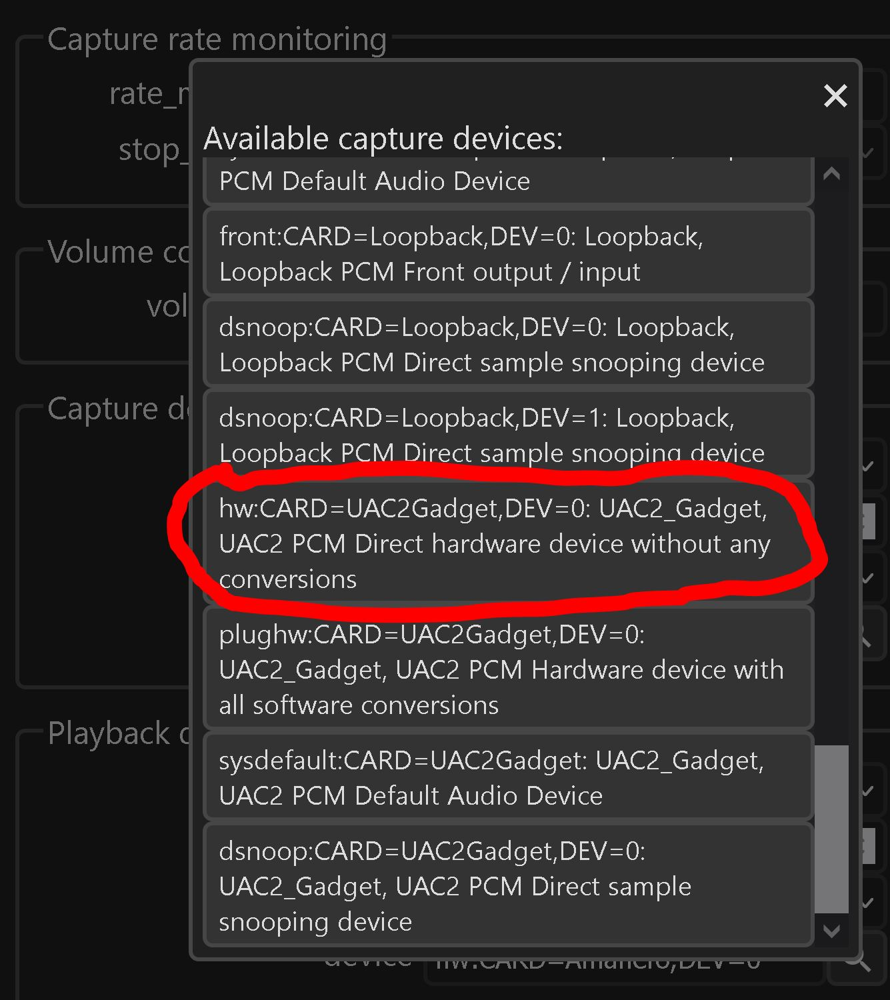
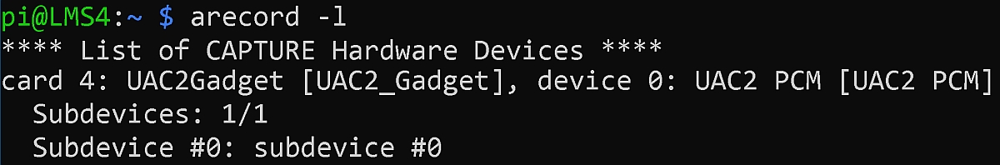

# USB gadget (USB OTG)
Through its USB Device Controller (UDC) Rapsberry Pi single board computers can be altered to take role as a USB peripheral device using its USB power socket. Here we will focus on making the USB input act as a digital audio receiver availiby for ALSA and CamillaDSP to capture music from. Connected to another computer this can see the RPi as a sound card. Where DSP can take place and then passed through to GPIO (I2C) or USB.
Testbase for this script where RPi-OS (Debian 11 bullseye) on RPI4.

### Connetion and power: 
Considering power requirement for RPi a special cable has to be made to separate data and +5V power rail. Power could also be connected to the GPIO pin and simply cut the +5V power line in the USB cable if the connected device has its own power. Three wires from the USB cable has to be connected for data transfer. Data+, Data- and Ground. The ID/Sense pin associated with USB OTG are already hard wired on the 'big' RPi boards.
https://en.wikipedia.org/wiki/USB_On-The-Go

### Background and code source:
Starting here back in 2019 this thread branches out to multiple sources. The end result here are thanks to several contributors with the main script used here to describe the USB device and its implementation are credited user Daihedz over at diyaudio.com.
https://www.diyaudio.com/community/threads/linux-usb-audio-gadget-rpi4-otg.342070/

### Super simple install
Copy, paiste and then run complete line of commands
```bash
cd ~/ && wget https://raw.githubusercontent.com/StillNotWorking/LMS-helper-script/main/USBgadget/installusbgadget.sh && bash ./installusbgadget.sh

```
Or read the install script here: https://raw.githubusercontent.com/StillNotWorking/LMS-helper-script/main/USBgadget/installusbgadget.sh

After install and reboot the USB gadget device should come up as a capture device in CamillaDSP drop down list. 

https://github.com/StillNotWorking/LMS-helper-script/blob/main/camilladsp/README.md#camilladsp-version-2-install-script-for-rpi-os-lite-64-bit

`alsar -l` should also list UAC2Gadget
