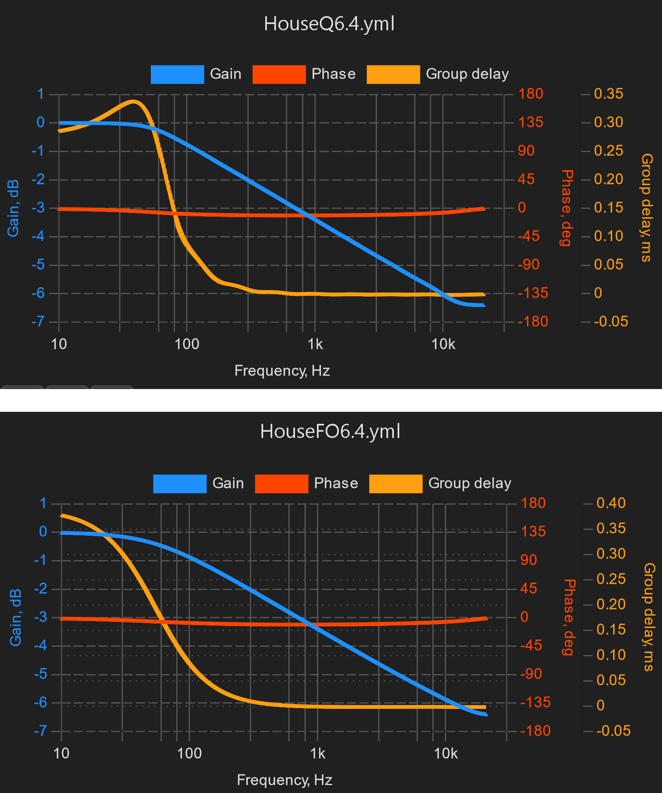

# CamillaDSP install script for RPi-OS Lite 64 bit

Intention with this script is to have RPi up running with Squeezelite and CamillaDSP ready to play 2 channel audio from the LMS system.

To get started the headphone output on the RPi are used as audio output. Your real DAC can be configured from CamillaGUI web page later on when you have RPi-OS recognise it.

You need a ready running RPi with latest **RPi-OS Lite 64 bit** on your network. Follow instruction here: https://www.raspberrypi.com/software/

Log on to your RPi with a SSH terminal of chose. Recommended user is `pi` (*se bottom of page*).
Then simply copy & paste all lines below and press `Enter` on your RPi terminal.
```bash
cd ~/
wget https://raw.githubusercontent.com/StillNotWorking/LMS-helper-script/main/camilladsp/installcamilladsp.sh
bash ./installcamilladsp.sh

```

Reboot the RPi and start playing music from your LMS system.

To access CamillaDSP open a web browser with adress `[IP adress to RPi:5000]`

# What is CamillaDSP
A tool to create audio processing pipelines for applications such as active crossovers or room correction.
https://www.diyaudio.com/community/threads/camilladsp-cross-platform-iir-and-fir-engine-for-crossovers-room-correction-etc.349818/
https://github.com/HEnquist/camilladsp
https://github.com/HEnquist/camillagui-backend/blob/master/README.md
# Filters
Script also download filters for demonstration. All 'House' filters are made up of eight high shelf biquad filters spaced one octave appart starting from 75 Hz. 
*Tip: simply remove lower filter(s) from the `Pipeline` if you want to test the overall filter starting from a higher frequency.*
Note that the Treble control on the `Shortcut` menu are a peak filter at 12000 Hz rather then the typical shelf filter. Very easy to edit with a drop down dialog.

There are two series of House filters. HouseQ have Q setting at 0.7. HouseFO use fist order high shelf filters. These are less flexible, but also have nicer group delay graph to tell them appart.




## NOTE: Installation asume the logged in user is `pi`
If another user than `pi` run the install script there are two service files that need to be edited and services initialized.
Change `{USER}` to your user name.
```
~$ sudo nano /etc/systemd/system/camilladsp.service
ExecStart=/usr/bin/camilladsp -p 1234 /home/{USER}/camilladsp/active_config.yml

~$ sudo nano /etc/systemd/system/camillagui.service
[Service]
User={USER}
ExecStart=/usr/bin/python3 /home/{USER}/camilladsp/gui/main.py

# then run
sudo systemctl daemon-reload
sudo systemctl start camilladsp
sudo systemctl enable camilladsp
sudo systemctl start camillagui
sudo systemctl enable camillagui

```

