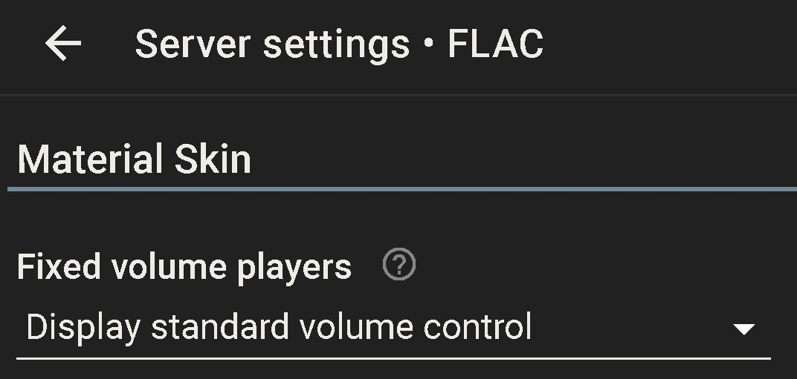

# Adjust volume on CamillaDSP from LMS player
**volumelms2cdsp.py** let you control CamillaDSP volume from LMS user interfaces.

## Principle of operation:
When Player has it volume control set to **Output level is fixed at 100%** from `Player -> Extra setting -> Audio -> Volume Control` we have the option to repurpose the volume slider.

When script is loaded it will have a telnet client connected to LMS Command Line Interface (CLI). Where it subscripe to CLI volume messages going from LMS out to the player. When changes occurs it will rescale value to decibel values -51 to 0dB compatible with CamillaDSP GUI and then forward this to CamillaDSP back-end.

Known limitation:
+ Some 100-200ms delay mostly coming from low CPU intensive Python loop with telnetlib3.<sup>1</sup>. 
+ Mute are not supported, but both interfaces allow for its implementation.

## Why would we want to use it?
Squeezelite usually leave it to alsa to adjust volume. We now potentially can avoid alsa do any processing on the stream other than bit depth expansion. 

***Note:*** If replay gain is enabled for the player there still are volume adjustment happening before CamillaDSP. 

## Less Loss
A special version complying with the theorem found in Leedh Processing<sup>2</sup> is availbly.

*Minimise the number of bits used to quantize volume control coefficients so that information loss is minimized at truncation stage. In other words, it trades volume control coefficients precision against information loss minimization.*

This version will snap volume setting to nearest value from an array of coefficients that should<sup>3</sup> not lose precision when truncated to 24-bit. Resolution are 32 steps for each 6dB change with varying step length<sup>4</sup>.

***Note:*** If CamillaDSP are configured to do any filter processing there most likely will take place calculation that end in truncating loss anyway, and this feature become useless.

## Install as daemon on RPi-OS (Debian) system
***Install script will try to resolve the following information. If it fails you'll be asked to input manually.***
+ **Player MAC address** - can be found under the information menu
+ **LMS server address**
+ **LMS Command Line Interface (CLI) port number** - default on server is 9090, can be changed from 'Server -> Plugins -> Command Line Interface (CLI)'
+ **CamillaDSP back-end port number** - often default to 1234
 
Log on to the machine CamillaDSP is running on with a terminal application of chose. Then simply copy & paste the line below into your terminal window.

```bash
cd ~/ && wget https://raw.githubusercontent.com/StillNotWorking/LMS-helper-script/main/camilladsp/volume_from_lms/installvolumelms2cdsp.sh && bash ./installvolumelms2cdsp.sh


```

**Less Loss** version can be installed using these commands
```bash
cd ~/ && wget https://raw.githubusercontent.com/StillNotWorking/LMS-helper-script/main/camilladsp/volume_from_lms/installvolumelms2llcdsp.sh && bash ./installvolumelms2llcdsp.sh


```

Install script can be read [here ](https://raw.githubusercontent.com/StillNotWorking/LMS-helper-script/main/camilladsp/volume_from_lms/installvolumelms2cdsp.sh)

Make sure the player volume are locked to 100% and Material Skin setting under `Server -> Plugins -> Material Skin` are set to 'Display standard volume control'



## Find version
`head -6 /usr/bin/volumelms2cdsp` will show version installed

## Stop or disable VolumeLMS2CDSP
```bash
# Temporary stop the daemon
sudo systemctl stop volumelms2cdsp

# Disable VolumeLMS2CDSP
sudo systemctl stop volumelms2cdsp
sudo systemctl disable volumelms2cdsp
sudo systemctl daemon-reload

```
## Remove VolumeLMS2CDSP
Script can disable and remove all files associated with its install by running script with argument --remove `bash volumelms2cdsp --remove`
To manually remove the install follow these steps: 
```bash
sudo systemctl stop volumelms2cdsp
sudo systemctl disable volumelms2cdsp
sudo rm /usr/bin/volumelms2cdsp
sudo rm /etc/systemd/system/volumelms2cdsp.service
sudo systemctl daemon-reload

# If support for telnet are no longer needed in Phython
sudo pip uninstall telnetlib3

```
## Control CamillaDSP volume from legacy Logitech devices or classic web UI
Script are dependent on functionality in Material Skin or a plugin that intercept volume changes LMS send to the Player. Known plugins that can intercept are IR Blaster, DenonAVP/AVR Control, and DenonSerial.

## Control other hardware or program from GPIO or USB
Script can be used as insperation to make control over other software and hardware connectet to the computer running the Player.

--------------------------------------------------------------------
<sup>1</sup> CLI are usually quite responsive in itself. Early attempts with this idea where first tested with bash script which showed better performance. A possible more responsive UI can be had if Material Skin send command direcly from its web UI. Although this will exclude legacy Logitech devices to function as controllers.

<sup>2</sup> Lossless Digital Volume control - https://www.processing-leedh.com/copie-de-presentation

<sup>3</sup> SoX was used to test bit depth `sox -v [coeff] [file] -n stats`

<sup>4</sup> Step resolution in dB. Multiply each value by two to get next 6dB interval.
```
0 dB
-0.13678849060610931953 dB
-0.27576568971266592797 dB
-0.41700277946240274791 dB
-0.56057447200487077544 dB
-0.70655924683485962037 dB
-0.85503960841899777469 dB
-1.00610236622791544894 dB
-1.15983893955373509852 dB
-1.31634568979286651491 dB
-1.47572428321837328367 dB
-1.63808208766196251291 dB
-1.80353260698176023292 dB
-1.97219595771901610887 dB
-2.14419939295736732989 dB
-2.31967787910747019714 dB
-2.49877473216599906257 dB
-2.68164232096339413735 dB
-2.86844284604626194394 dB
-3.05934920417086983811 dB
-3.25454594995399480204 dB
-3.45423036808601289755 dB
-3.65861367171973416119 dB
-3.86792234528303353541 dB
-4.08239965311849561710 dB
-4.30230733914775929559 dB
-4.52792754734154029060 dB
-4.75956499833784348945 dB
-4.99754946433199812524 dB
-5.24223859267223071563 dB
-5.49402113883264095053 dB
-5.75332068211999386471 dB
-6.02059991327962390423 dB
```