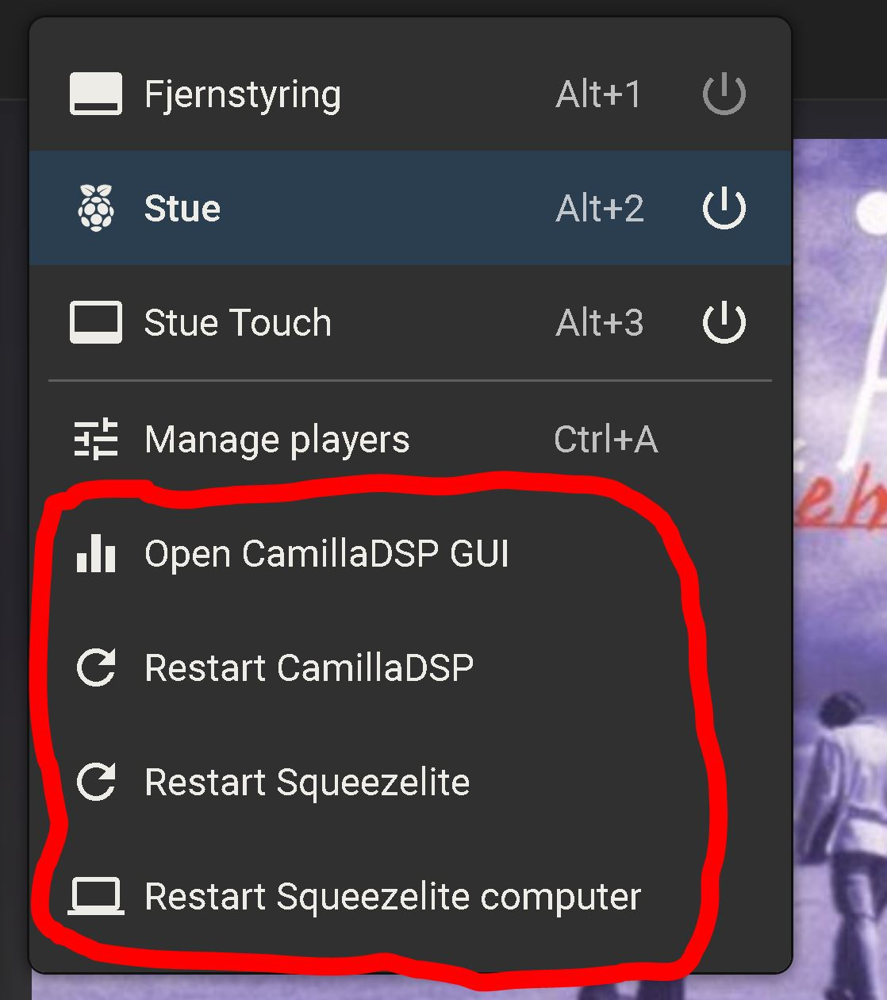
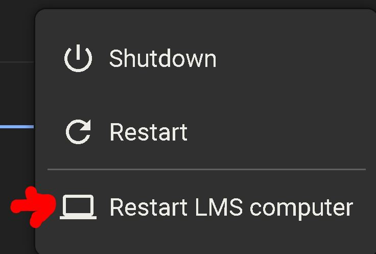

# Custom menus in Material skin
This guide and scripts will describe how to add menus that can control daemons running on the LMS server and remote linux computers using stored bash commands activated from Material Skin UI.

Guidance is based on a default LMS installation on RPi-OS. But guide should function on most Linux distros with minimal changes, — if any. Just very whos running the LMS daemon. Using `htop` might be the easiest way to check this.

### Add menus
It is a good idea to first familiarize oneself with Craig Drummond's customisation guide for Material Skin: https://github.com/CDrummond/lms-material/wiki/07-Customisation
We will here demonstrate how to add four custom menus associated with a single player linked to its MAC address. And a option under the Server Settings menu to reboot the computer running LMS.
<br />  

**We create menu items by edit the `actions.json` file:**
```
sudo nano /var/lib/squeezeboxserver/prefs/material-skin/actions.json
```
Here is the JSON code for the four example menus. Code should be edited to reflect your system MAC and IP addresses. This information can be found from Material Skin > Information.
```
{
  "server-dialog":[
    {
      "title":"Restart LMS computer",
      "command":"sudo reboot &",
      "icon":"computer",
      "prompt":"Restart LMS computer?"
    }
  ],
  "players":[
    {
      "title":"Open CamillaDSP GUI",
      "weblink":"http://192.168.10.128:5000",
      "players":["d8:3a:dd:46:ef:04"],
      "icon":"equalizer"
    },
    {
      "title":"Restart CamillaDSP",
      "command":"sudo ssh pi@192.168.10.128 \"sudo systemctl restart camilladsp\" &",
      "players":["d8:3a:dd:46:ef:04"],
      "icon":"refresh",
      "prompt":"Restart CamillaDSP?"
    },
    {
      "title":"Restart Squeezelite",
      "command":"sudo ssh pi@192.168.10.128 \"sudo systemctl restart squeezelite\" &",
      "players":["d8:3a:dd:46:ef:04"],
      "icon":"refresh",
      "prompt":"Restart Squeezelite?"
    },
    {
      "title":"Restart Squeezelite computer",
      "command":"sudo ssh pi@192.168.10.128 \"sudo reboot\" &",
      "players":["d8:3a:dd:46:ef:04"],
      "icon":"computer",
      "prompt":"Restart Squeezelite computer?"
    }
  ]
}

```
### Run bash commands from Material Skin
For security purposes users running daemons usually have very restricted access to the system. This is also true for user `squeezeboxserver` normally running LMS webserver where Material Skin is running from. We have to change this, — and we are going all out here where user will be able to run `sudo` without even typing a password. **One should understand the risk of doing this if the LMS server is on a network where users can have ill intents**<sup>1</sup>.
<br />
Now for the changes needed please read inline comments in code below. <i>It should be possible to copy paste the complete code into your terminal window.</i> [Or download the script]/materialskin/user_squeezeboxserver.sh
```bash
# Change system privileges for user 'squeezeboxserver'
# Before we start make a copy of settings in passwd
sudo cp /etc/passwd /etc/passwd_org_squeezeboxserver
#sudo cat /etc/passwd 
# We should read something like this
# squeezeboxserver:x:109:65534:Logitech Media Server,,,:/usr/share/squeezeboxserver:/usr/sbin/nologin

# Add shell for user 'squeezeboxserver':
sudo usermod -s /bin/bash squeezeboxserver
# Verify changes in passwd with sudo cat /etc/passwd
# squeezeboxserver:x:109:65534:Logitech Media Server,,,:/usr/share/squeezeboxserver:/bin/bash

# Add user squeezeboxserver to group 'sudo'
sudo usermod -a -G sudo squeezeboxserver

# We need user 'squeezeboxserver' to be able to 'sudo' without password
# Later on you might want to put more selective priveliges for the user in this file
sudo -i
echo "squeezeboxserver ALL=(ALL) NOPASSWD: ALL" > /etc/sudoers.d/010_squeezeboxserver-nopasswd
chmod 440 /etc/sudoers.d/010_squeezeboxserver-nopasswd
logout

# Change owner from 'root' of home directory for user 'squeezeboxserver'
sudo chown -R squeezeboxserver /usr/share/squeezeboxserver

# How to list sudo users in group 'sudo' from /etc/group
#sudo getent group sudo | cut -d: -f4

```

### Run bash commands on remote computer with `ssh`
For Material Skin to be able to run bash commands they should not need any input, — as for instance a password.<br />
For this to happen with `ssh` we need to create and exchange ssh keys.

From the mashine running LMS & Material-Skin type:
```
ssh-keygen
```
Then copy the key to the remote computer. User should be member of the sudo group with credential to register the key.
```
ssh-copy-id pi@192.168.10.128
```
### More complex commands
`bash` let us link a series of commands with ` && `. Where code execution stops if the command before the double ampersand sign fail. Or we can store multiple commands in `.sh` script files. On the first page for this repository you can read more about how to make script files executable.

Don't forget Material Skin also support flexible ways to run code from the browser.

---------------------------------------------------------------

<sup>1</sup> It is possible to restrict the sudo user to only execute a limited number of applications. Instead of using `ALL` in the file we created under `/etc/passwd.d` we specifically define full path to the applications the user are allowed to run with sudo. 
```
# First decline all sudo credentials, then add those we want to allow.
squeezeboxserver ALL=(ALL) !ALL
squeezeboxserver ALL=NOPASSWD: /bin/ssh /sbin/reboot
```