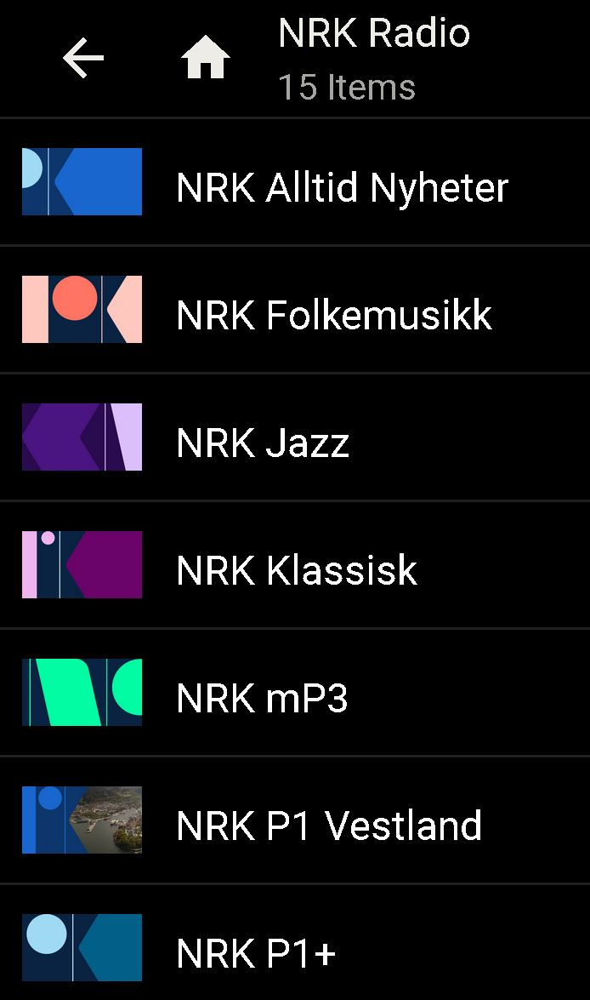
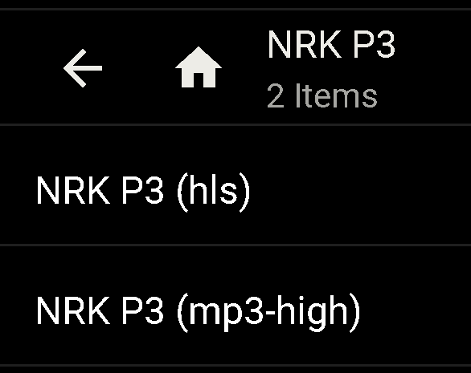
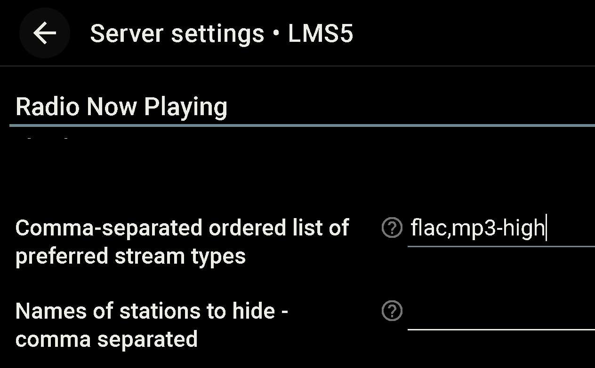

# NRK - Favorite links to Norsk Riks Kringkasting
As radio links to NRK found in other radio plugins often link the AAC 48 kbps stream rather than the 192 kbps MP3 stream we made this `favorites.opml` file including 15 radio "station" provided by NRK.



From the Classic web GUI (http://192.168.x.x:9000/Default) there is a merge function found on the bottom of you favorites list.
Press `Edit` (*pen icon*) on the `Favorites` folder, then scroll down to the `Import` button and paiste in this path:
```
https://raw.githubusercontent.com/StillNotWorking/LMS-helper-script/main/nrk/favorites.opml
```
Now using Material Skin web GUI, — from the Favorites list select your favorite NRK station and select `Pin to home page` from dropdown menu. You can Un-pin at any time from Material Skin home page.

*When this is written Material Skin are missing the import button hence the need to temporary use the Classic web GUI by adding `/Default` to the LMS server address.*

### Known limitations:
Radio station icons are now provided using link to static images from the NRK site. In conversation with NRK support it seems these streams do not publish relevant icons or cover art. If cover art is significant, see below tip how to upgrade the 'Radio Now Playing' plugin.

**Note:** Track information and certain metadata are accessible by clicking the `More` option in the drop-down menu of Material Skin. Legacy Logitech devices like Touch do not have this More option.

Only link to the `Vestland` region are provided for NRK P1. You can edit this favorite from the web GUI using path to your region found on this page http://lyd.nrk.no/
You want the link ending with `_mp3_h` for the 192 kbps stream.

### Radio Now Playing:
This great plugin provides access to numerous radio stations. Unfortunately, all links to NRK are at 128kbps VBR AAC. We have updated the `stationdata-nrkno.json` to also include 192kbps CBR MP3 streams. Despite these streams functioning correctly with accurate metadata, including program and cover art, the RNP plugin developer insists on implementing only the official HLS streams from NRK. Therefore, manual installation of the NRK stations description file is necessary.



First install the plug `Radio Now Playing`. This plug need a transcoder plug `PlayHLS versjon 2` to function. When this is written, v2 versions install part are not ready and this version need to be manually added as instructed here: https://forums.slimdevices.com/forum/user-forums/3rd-party-software/99692-announce-playhls-plugin-plugin-to-play-apple-hls-m3u8-stream#post1195368

When install is ready copy the `stationdata-nrkno.json` into to the plugin directory. These Linux commands should do the trick:
```bash
cd /var/lib/squeezeboxserver/cache/InstalledPlugins/Plugins/RadioNowPlaying/stationdata
sudo mv stationdata-nrkno.json stationdata-nrkno.json-backup
sudo wget https://raw.githubusercontent.com/StillNotWorking/LMS-helper-script/main/nrk/stationdata-nrkno.json
```
Note: LMS need to be restarted for `Radio Now Playing` to read in any new stations and hyperlinks.

If one rater have the RNP plugin only use the higher bit rate (*as in hide lower bit rates*).  
From `Server settings -> Radio Now Playing` make a list in the order you want different formats to be prioritised. This setting is global for all stations.



### Tip:
If you like to edit the `favorites.opml` manually you find the path to the preferences folder on the LMS information page in the web GUI. On Linux this directory is `/var/lib/squeezeboxserver/prefs`
Typically path to custom icons have to be manually edited.

Path to a generic radio image could be "html/images/radio.png". This path is relative to the directory from where the web GUI are loaded. For Linux this path is `/usr/share/squeezeboxserver/HTML/Default/html/images`
